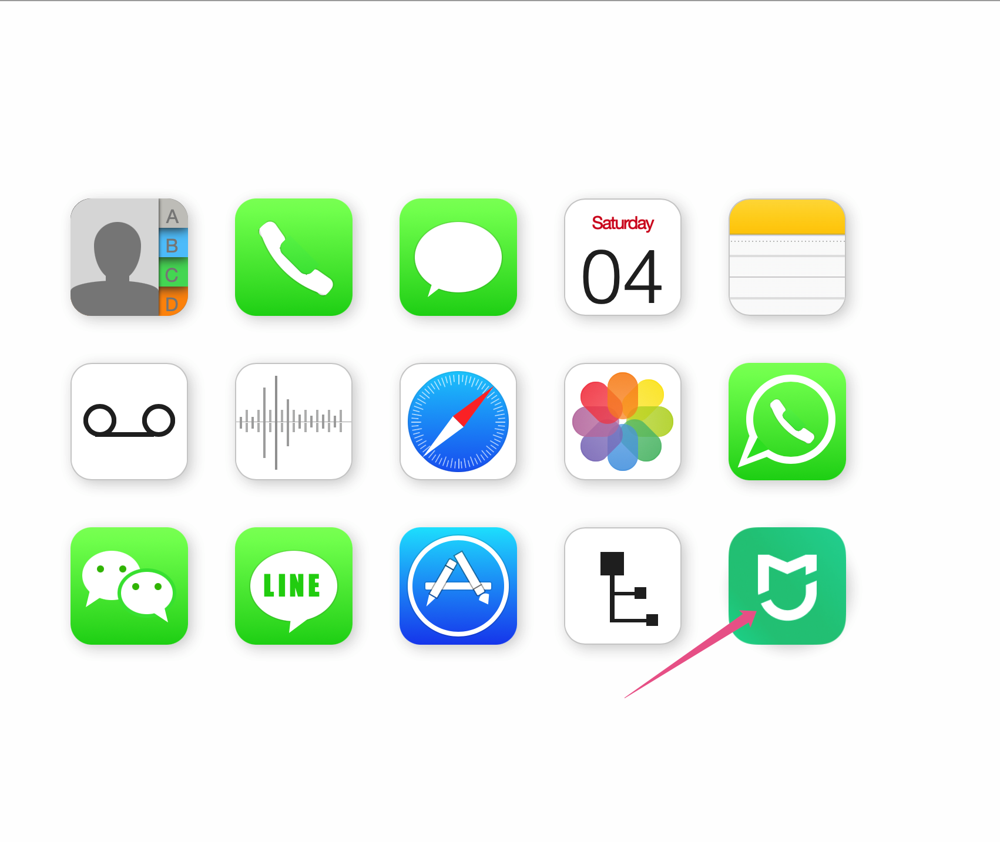
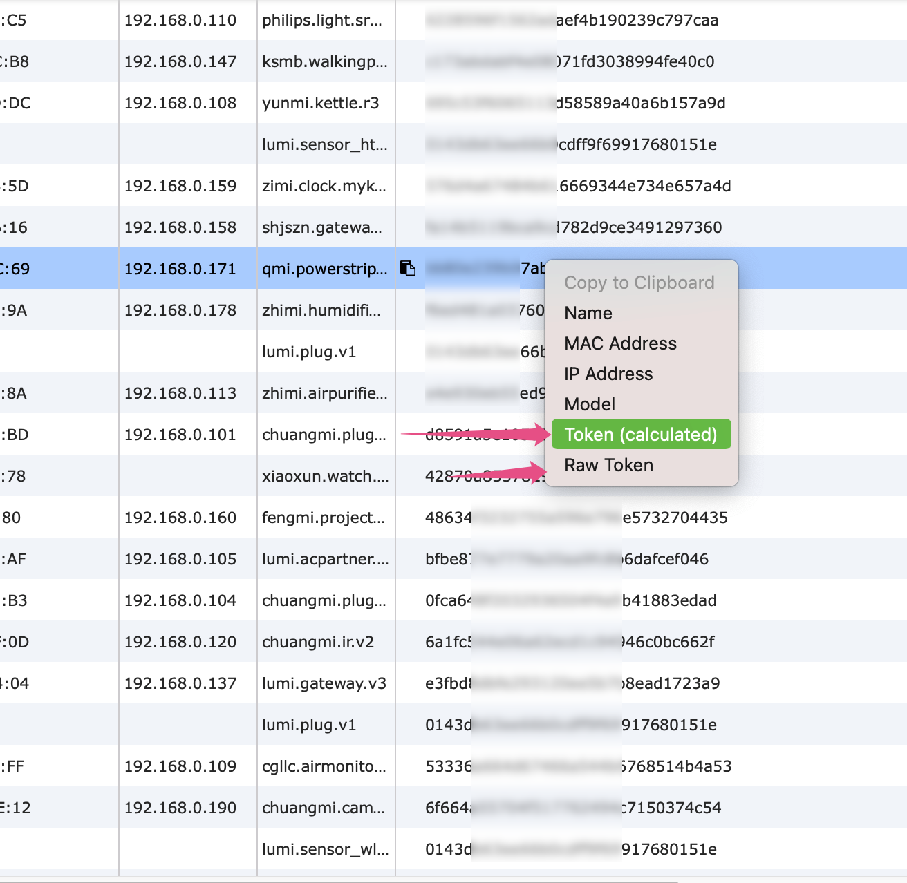

# Xiaomi AC Partner with Gree Air Condition

Home Assistant+米家空调伴侣 遥控器型号为YAP0FB2的格力空调 （有Ey易享模式的空调）

基于 https://github.com/syssi/xiaomi_airconditioningcompanion


在configuration.yaml中添加

```
climate:
  - platform: xiaomi_miio_gree
    name: Gree AC
    host: 192.168.10.12
    token: 【token】
    target_sensor: sensor.temperature_158d0001f53706 #温度传感器
    scan_interval: 10
```    


# How to retreive Xiaomi device token
For iPhone user:

1. Download [iBackup Viewer](https://www.imactools.com/iphonebackupviewer/)   windows or mac version
2. Create a backup with iTunes or iBackup Viewer
3. Launch iBackup Viewer

If the Mihome app was installed, then iBackup Viewer will list MiHome icon.



Click the MiHome icon to get the devices, find the device and right-click on the row, then choose "Token (calculated)" to copy the token of the device to clipboard. 
Clicking on  "Raw Token" will copy the original 96 characters to clipboard.



# 如何获取小米设备的token
如果你用iPhone:

1. 首先下载 [iBackup Viewer](https://www.imactools.com/iphonebackupviewer/) windows版 或者mac版
2. 用iTunes或者iBackup Viewer创建新的备份（iBackup Viewer可以在任意文件夹创建备份）
3. 打开iBackup Viewer

如果你的iPhone安装了米家app，那么iBackup Viewer会显示米家app 图标


点击米家app图标， 会列出所有小米设备， 找到想要的设备在这一行按鼠标右键， 在弹出菜单中选择"Token (calculated)"就会将该设备的token复制到剪切板。
如果选择"Raw Token" 就会把原始的96字符串复制到剪切板，如果你想自己计算token的话:)。


